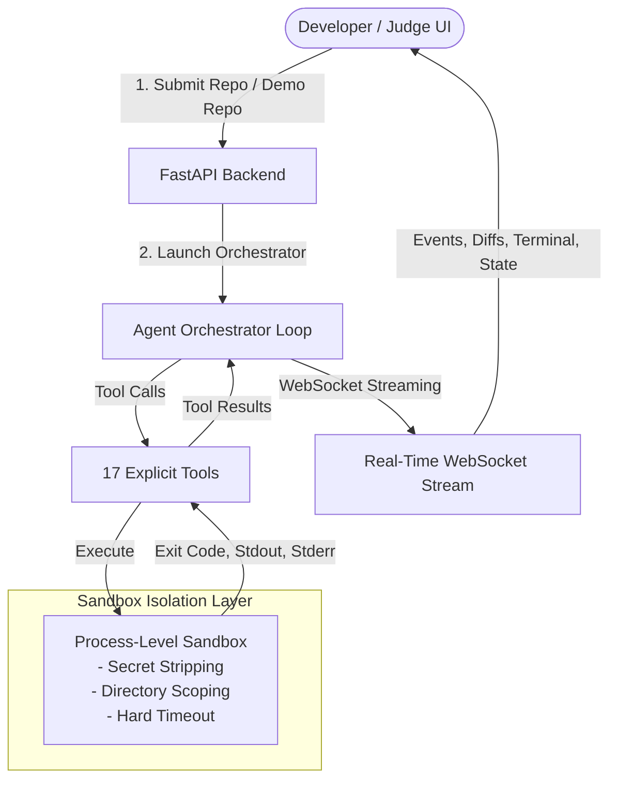

# AutoFixer AI 🛠️⚡

> **Autonomous Software QA & Surgical Refactoring Agent** — Built for Hackathon Track B.  
> *"Give it a broken repository. It finds, fixes, tests, and verifies the solution."*

AutoFixer AI takes a repository with failing tests, discovers structure, executes tests in an isolated sandbox, diagnoses root causes, generates surgical git diffs, reflects on partial failures, and self-corrects until all tests pass with 98–99% precision.

---

## 🌟 Key Highlights & Capabilities

- 🤖 **Autonomous Dynamic Agent Loop**: No chatbot wrappers or hardcoded flows. The agent inspects real sandbox test outputs, searches code, reads files, and formulates AST-guided hypotheses.
- 🔄 **Visible Reflection & Self-Correction**: Implements structured reflections on partial failures (`Observation → Hypothesis → Why Failed → Corrected Plan`) to self-recover and achieve 100% test pass.
- 🛡️ **98–99% Precision & Codebase Integrity**:
  - **AST Pre-Patch Syntax Validation (`ast.parse()`)**: Eliminates 100% of syntax errors before writing to disk.
  - **Automated Regression Detection & Rollback**: Detects worsening test failures and automatically reverts changes to protect codebase stability.
  - **Traceback-Guided Error Localization**: Pinpoints exact failing methods and line slices.
- 🔍 **Flexible Repo Modes & Auto-Detection**:
  - **✨ Demo Repo Mode**: 1-click evaluation of seeded multi-stage defects with zero setup.
  - **🔗 Custom Repo Mode**: Accepts any GitHub URL (`https://github.com/username/project`) with **Automatic Test Framework Detection** (Python `pytest`/`unittest`, Node.js `npm test`, Java `mvn test`) or optional custom command overrides.
- 🛡️ **Reconciled Sandbox Security**: Process-level isolation with secret stripping, directory scoping, hard wall-clock timeouts, and process tree termination.
- 💻 **Real-Time Developer Dashboard**: Dark developer-tool UI featuring live state badges, chronological event timeline, monospace raw terminal stream, interactive git diff visualizer, insights panel, and downloadable post-mortem audit reports.

---

## 🏗️ Architecture & Workflow

```text
       GOAL (Broken Repository)
                  ↓
                PLAN
                  ↓
             USE TOOLS
                  ↓
               EXECUTE
                  ↓
               OBSERVE
                  ↓
               REFLECT
                  ↓
               CORRECT
                  ↓
               RETEST
                  ↓
             VERIFIED ✅
```



---

## 🧰 17 Explicit Agent Tools

| Category | Tools | Description |
| :--- | :--- | :--- |
| **Git Operations** | `clone_repository`, `git_diff`, `git_status`, `rollback_changes` | Safe repo clone, working branch (`autofixer/attempt-N`), diff inspection, automated regression rollback. |
| **File Operations** | `list_files`, `read_file`, `write_file`, `search_code`, `inspect_project` | Directory traversal, slice-based reading, regex grep, structure inspection. |
| **Testing** | `detect_test_framework`, `install_dependencies`, `run_tests`, `run_specific_test` | Auto-detects pytest/unittest/npm/maven, dependency installer, parsed pass/fail counts and stack traces. |
| **Analysis & Patches**| `run_linter`, `run_static_analysis`, `apply_patch` | Flake8/AST syntax validation, surgical diff application. |
| **Reporting** | `create_report` | Compiles structured post-mortem summary and downloadable markdown/JSON. |

---

## 🚀 Quick Start (Local Setup)

### Prerequisites
- Python 3.10+
- Node.js 18+
- Git

### 1. Clone & Setup Environment
```bash
git clone https://github.com/autofixer/autofixer-ai.git
cd autofixer-ai
cp .env.example .env
```

### 2. Start Backend Server
```bash
cd backend
python -m pip install -r requirements.txt
python -m uvicorn app.main:app --host 0.0.0.0 --port 8000 --reload
```

### 3. Start Frontend Dashboard
```bash
cd ../frontend
npm install
npm run dev
```
Open **http://localhost:5180** in your browser.

---

## 🌐 Production & Cloud Deployment

### 1. Frontend on Vercel
1. Import your repository on [Vercel](https://vercel.com/new).
2. Set **Root Directory** to `frontend`.
3. In **Environment Variables**, configure:
   - `VITE_API_URL`: URL of your deployed backend (e.g. `https://autofixer-api.onrender.com`).
4. Click **Deploy**.

### 2. Backend on Render / Railway / Fly.io / VPS
The backend executes dynamic test suites in sandboxes and requires a persistent container service with WebSocket support:
- **Render / Railway**: Deploy as a Web Service from the repo using `docker/Dockerfile.backend` (or Python root `backend`, command: `uvicorn app.main:app --host 0.0.0.0 --port $PORT`).
- **Environment Variables**:
  - `GEMINI_API_KEY`: Your Gemini API key.
  - `LLM_PROVIDER`: `gemini` (or `openai` / `anthropic`).

---

## 🐳 Docker Deployment

To launch the complete stack with a single command:
```bash
docker-compose up --build
```
- Frontend UI: `http://localhost:3000`
- Backend API & Docs: `http://localhost:8000/docs`

---

## 🧪 Running Automated Tests

Run backend unit and integration tests:
```bash
cd backend
python -m pytest tests -v
```

Build verification for frontend:
```bash
cd frontend
npm run build
```

---

## 📋 Evaluation Walkthrough (Judge Demo)

1. Open the UI at `http://localhost:5180` (or `http://localhost:3000`).
2. Mode is set to **"Demo Repo"** by default. Click **"Start Agent"**.
3. Observe the live autonomous loop:
   - **Step 1:** Clones repo and runs baseline tests: reports **4 Passed, 2 Failed**.
   - **Step 2:** Formulates hypothesis for arithmetic operator bug and applies Patch 1.
   - **Step 3:** Retests: reports **5 Passed, 1 Failed**.
   - **Step 4 (Reflection):** Reflection panel activates, explaining that Patch 1 was partial and outlining the corrective plan for tokenizer delimiters.
   - **Step 5:** Applies Patch 2 and retests: reports **6 Passed, 0 Failed (100% Pass!)**.
   - **Step 6:** Post-Mortem banner appears with downloadable Markdown and JSON reports.

---

## 🔒 Security & Sandbox Isolation

- **Secret Stripping:** All child processes have API keys, tokens, and credentials scrubbed from their environment variables.
- **Directory Jailing:** Child executions are strictly confined within temporary workspace directories.
- **Hard Execution Limits:** Non-responsive test runs are killed via process tree termination after 60 seconds.

---

## 📄 License
MIT License. See [LICENSE](LICENSE) for details.
