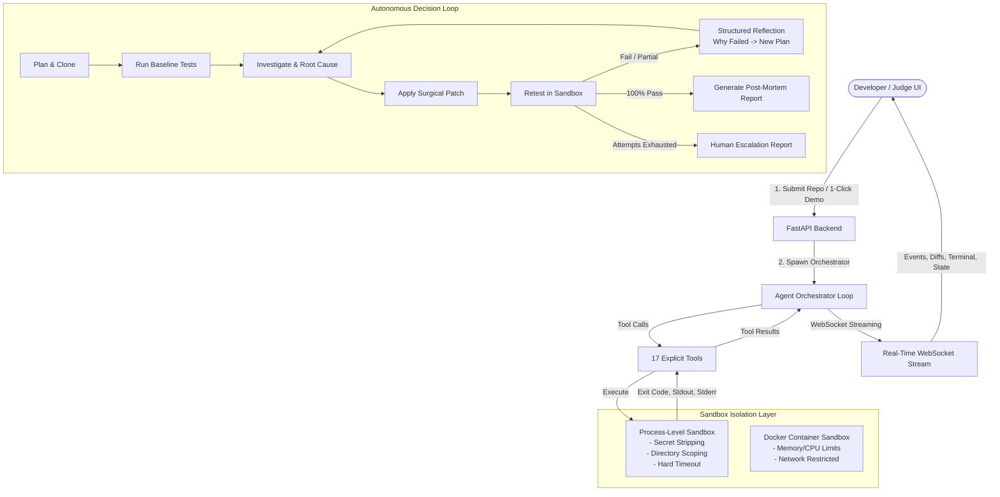

# AutoFixer AI — System Architecture & Design

AutoFixer AI is an autonomous Software QA & Refactoring Agent for Hackathon Track B. It autonomously clones repositories with failing tests, runs tests in an isolated sandbox, performs root cause investigations, generates surgical git diffs, re-evaluates outcomes, reflects on partial failures, and self-corrects until all tests pass or iteration caps are reached.

---

## 1. High-Level Architecture



---

## 2. Dynamic Agent Workflow Cycle

```
User Input → Plan → Tool Call → Observe Sandbox → Formulate Root Cause →
Apply Surgical Diff → Retest → Observe →
[If Partial Fail] → Structured Reflection → Refined Patch → Retest →
[On 100% Pass] → Final Post-Mortem Report
```

1. **Discovery & Repo Mapping:** Clones repository, detects language, dependencies, and test framework (`pytest`/`unittest`).
2. **Baseline Execution:** Runs test suite in sandbox, extracts total, passed, failed, skipped, and error stack traces.
3. **Investigation:** Performs targeted code searches and reads relevant files to establish `Symptom → Hypothesis → Root Cause → Proposed Fix`.
4. **Surgical Patching:** Generates minimal line replacements (not complete file rewrites) and pre-validates AST syntax.
5. **Sandbox Retesting:** Re-executes test suite in sandbox and compares before/current deltas.
6. **Structured Reflection:** If tests still fail, extracts a structured reflection:
   - `Observation`
   - `Hypothesis`
   - `Evidence`
   - `Previous Action`
   - `Why It Failed`
   - `New Plan`
   - `Expected Result`
   - `User Summary`
7. **Resolution:** Emits final post-mortem report and diff history.

---

## 3. Sandbox Security Model

AutoFixer AI implements a high-security process-level isolation model:
- **Environment Sanitization:** Host environment variables containing keywords like `KEY`, `SECRET`, `TOKEN`, `PASSWORD`, `CREDENTIAL`, `API`, `GEMINI`, `OPENAI`, `ANTHROPIC` are stripped before spawning subprocesses.
- **Directory Containment:** All file paths are strictly resolved against the temporary workspace root to prevent directory traversal attacks (`..`).
- **Hard Wall-Clock Timeout:** Subprocesses that exceed execution limits are automatically terminated with complete process tree termination.
- **Resource Protection:** Prevents fork bombs and zombie processes.
